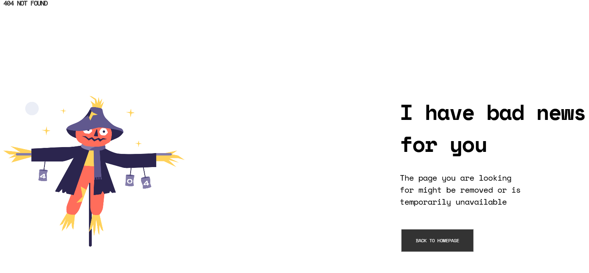

<h1 align="center">404 Error Page</h1>

   Solution for a challenge from  <a href="http://devchallenges.io" target="_blank">Devchallenges.io</a>.

  <h3>
    <a href="https://github.com/snellc1/404-Error-Page" target="_blank">
      Demo
    </a>
     | 
    <a href="https://snellc1.github.io/404-Error-Page/" target="_blank">
      Solution
    </a>
     | 
    <a href="https://devchallenges.io/challenges/wBunSb7FPrIepJZAg0sY" target="_blank">
      Challenge
    </a>
  </h3>

<!-- TABLE OF CONTENTS -->

## Table of Contents

- [Overview](#overview)
- [Features](#features)
  - [Built with](#built-with)
  - [Links](#links)
- [Contact](#contact)

<!-- OVERVIEW -->

## Overview

## Features

<!-- List the features of your application or follow the template. Don't share the figma file here :) -->

This application/site was created as a submission to a [DevChallenges](https://devchallenges.io/challenges) challenge. The [challenge](https://devchallenges.io/challenges/wBunSb7FPrIepJZAg0sY) was to build an application to complete the given user stories.

### Built with

- Semantic HTML5 markup
- CSS custom properties
- Media Query
- Mobile-first workflow

### Links

- Solution URL: [https://github.com/snellc1/404-Error-Page](https://github.com/snellc1/404-Error-Page)
- Live Site URL: [https://snellc1.github.io/404-Error-Page/](https://snellc1.github.io/404-Error-Page/)

## Contact

- GitHub [@snellc1](https://github.com/snellc1)
